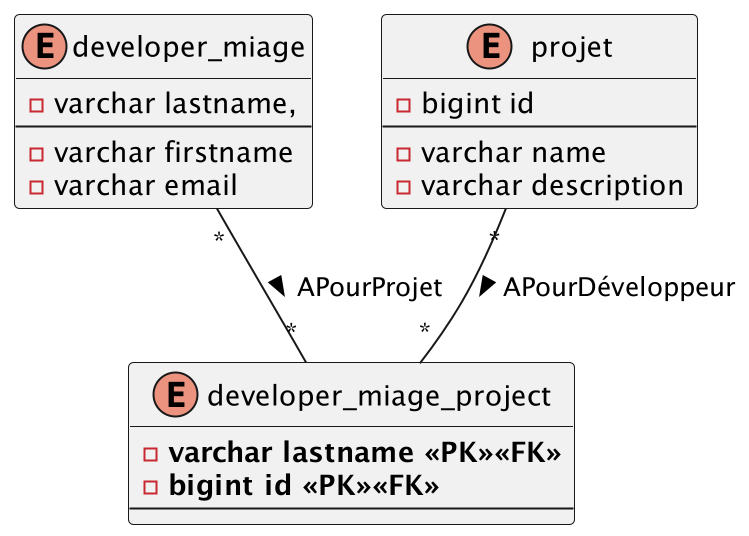
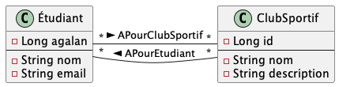

# <u>L3 Miage - BDD - TP2 - EXO 1</u>

* Pour pouvoir démarrer tous les TP simplement, assurez-vous d'avoir tous les prérequis :
    * voir les [prérequis](prerequis.md)

# Objectif de l'exercice :

Dans cet exercice, vous allez apprendre à :

* Créer des relations @ManyToMany

## Dans le paradigme `validate`

1. Modéliser ses tables existantes en base, en JPA :
 * 

## Dans le mode `create`

1. Faire passer l'attribut en mode `create` dans le fichier [application.yml](server/src/main/resources/application.yml)
2. Modéliser ces classes en JPA : 
    * 
* ⚠️ une seule table d'association doit apparaitre.
--- 

# 
Fin de l'exo 1
