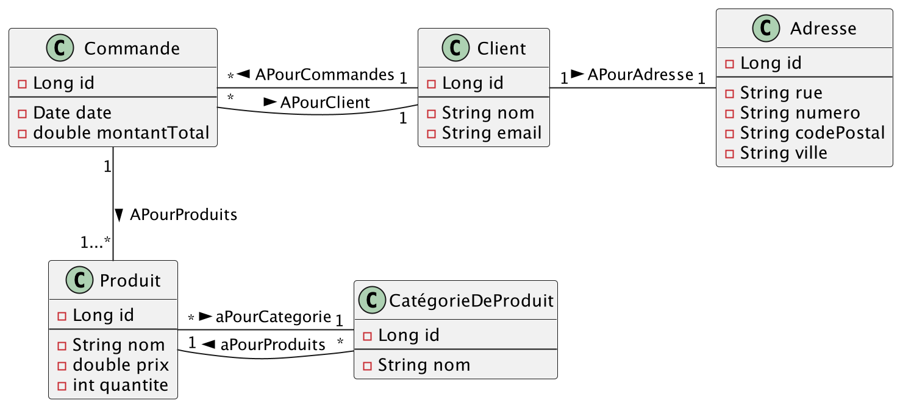

# <u>L3 Miage - BDD -TP2 - EXO 3</u>

* Pour pouvoir démarrer tous les TP simplement, assurez-vous d'avoir tous les prérequis :
    * voir les [prérequis](prerequis.md)

# Objectif de l'exercice :

Dans cet exercice, vous allez apprendre à :

* Représenter un modèle JPA simple à partir d'un schéma applicatif

## Dans le mode `create`

1. Faire passer l'attribut en mode `create` dans le fichier [application.yml](server/src/main/resources/application.yml)
2. Modéliser ces classes en JPA : 
    * 
--- 

## Questions : 

1. À votre avis est-ce que toutes les relations bidirectionnelles sont importantes ? Pourquoi ?

# 
Fin de l'exo 3
