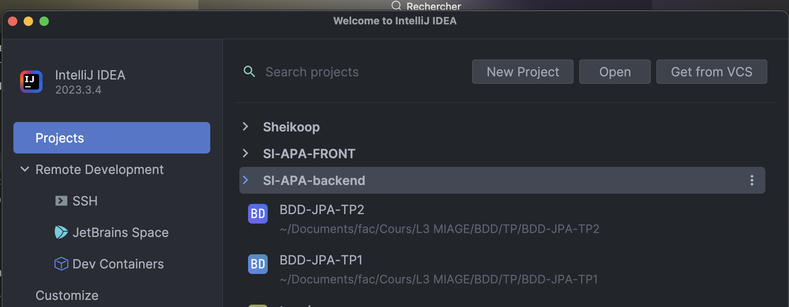
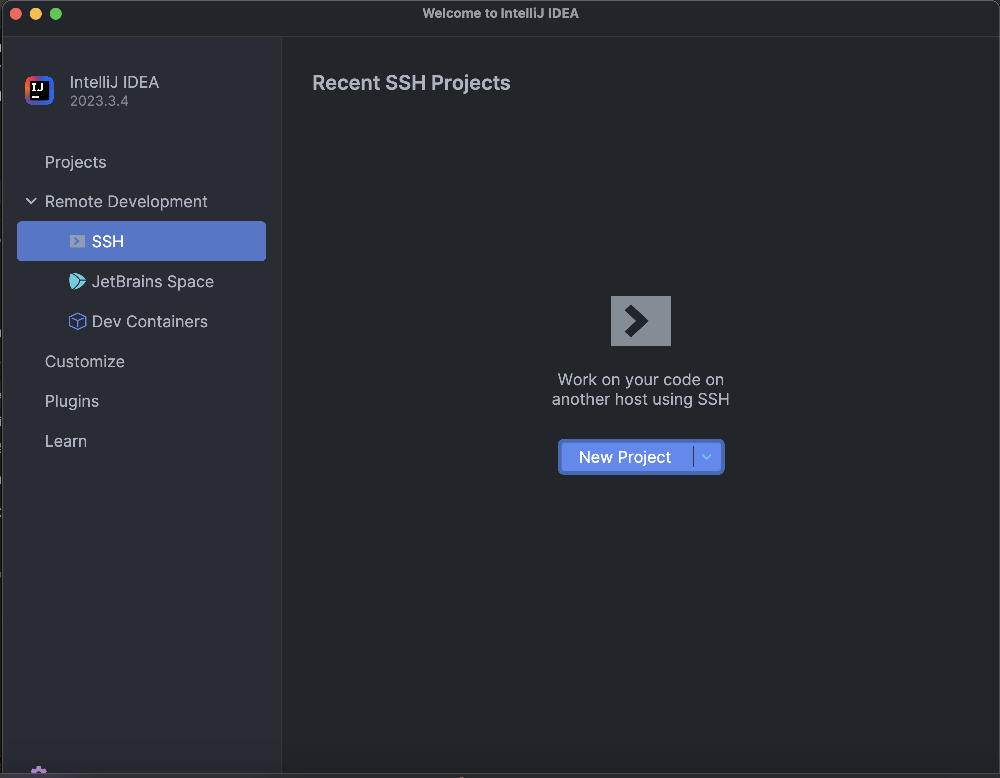
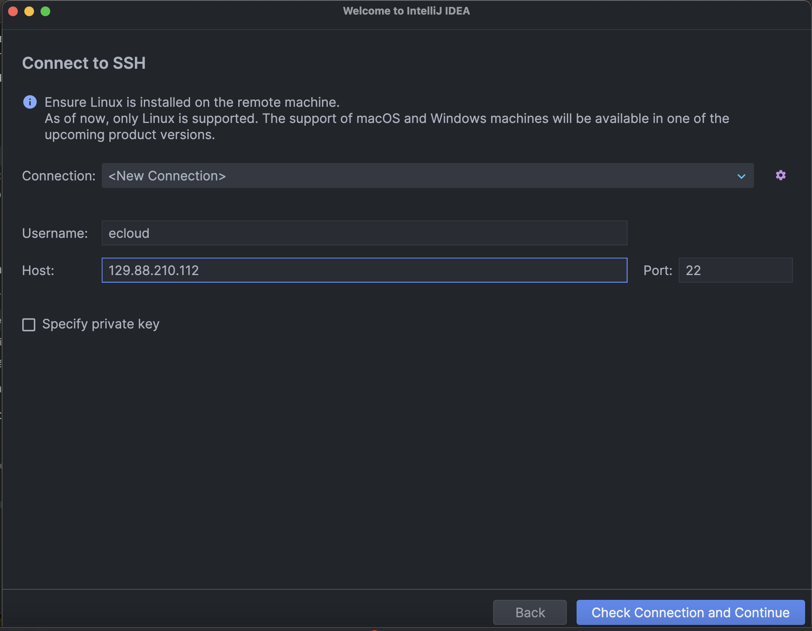
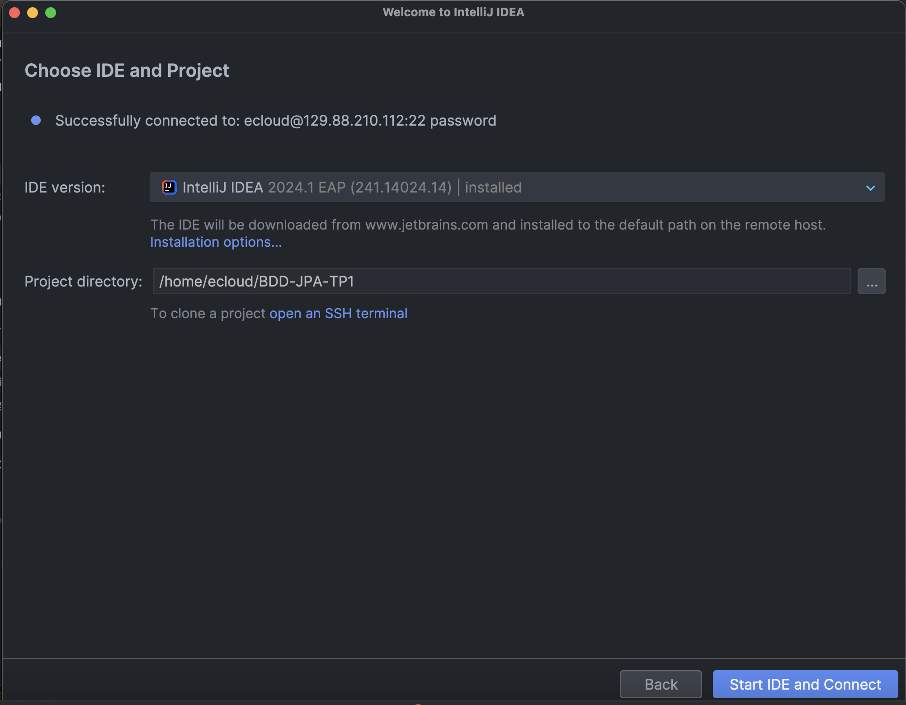

# Prérequis


## Sur les VM

* Vous avez des VM disponibles avec :
    * Maven
    * docker
    * docker-compose
    * Java 15

* Pour avoir les VM faire la demande sur [ecloud](https://im2ag-ecloud-vidm.u-ga.fr/) et mettre les options suivantes :
    * 2 cores
    * 4 GB de ram
    * installer java
    * installer maven

Lorsque vous avez l'adresse ip de la VM, il faut :

1. Se connecter en ssh à la machine :
```shell
ssh -X utilisateur@128.XX.XX.XX
```

2. Définir votre `JAVA_HOME` pour maven

```shell
echo "export JAVA_HOME=/opt/jdk-15.0.1" >> .bashrc
source .bashrc
```

3. Tester que cela convient à `maven` :
```shell
mvn -v
```

4. Faire un clone de votre repo git :

```shell
git clone <votre-repo>
```

5. Fermer votre connexion ssh :

```shellls
exit
```


### Développement depuis intellij
`Intellij` propose un service de `SSH` avec lequel vous pouvez directement coder sur votre machine, sur la VM.

Pour cela aller dans SSH :


Créer un nouveau projet :


Puis remplir les informations de votre VM :


Renseigner votre directory de projet et un intellij s'ouvrira directement sur votre VM.



### Base de données sur la VM

Une fois sur la VM démarrer la commande pour lancer votre base de données :

```shell
docker-compose -f docker/docker-compose.yml up &
```

et ensuite vous pouvez voir votre base de données sur `pgadmin` avec votre adresse Ip, donc :
```
http://128.XX.XX.XX
```

## En local

Pensez à avoir :
* Avoir `java 15`
* Avoir `maven`
* Avoir `docker desktop`
    * Si docker n'est pas installé, aller voir ce <a href="https://docs.docker.com/desktop/install/windows-install/">tuto</a>
* Avoir `docker-compose`
    * Si docker-compose n'est pas installé, aller voir ce <a href="https://docs.docker.com/compose/install/">tuto</a>

### Base de données via docker

Pour installer la BD postgres, vous n'avez qu'à compiler le docker compose, mettez-vous à la racine du projet et tapez la commande suivante :
```shell
docker-compose -f docker/docker-compose.yml up
```

Cette commande va créer 2 conteneurs, un `postgres` et `pgAdmin`

#### PgAdmin

* Il vous permet d'avoir une vision directe sur votre base de données ici : [pgAdmin](http://localhost)
* Identifiant de connexion :
```yml
email : admin@admin.com
password: root
```

Étapes pour connecter votre bd :
1) Ajouter un serveur dans pgAdmin
   
2) Remplir avec les informations suivantes :
   ```yml
   host: example-db
   port: 5432
   username: postgres
   password: postgres
   ```
   en photo :

   

